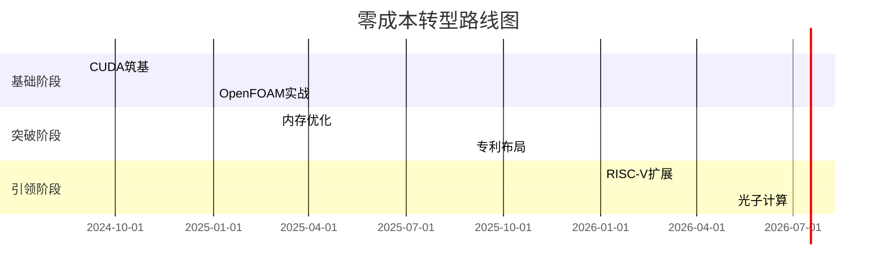

# 一、阶段1：GPU计算筑基（0 - 6个月）
## 目标
掌握工业级GPU加速技能，完成首个开源项目

## 核心逻辑
通过免费资源 + 实战项目快速构建竞争力

## 学习资源与计划
|技能模块|免费资源|重点内容|实践项目|
| ---- | ---- | ---- | ---- |
|CUDA编程|- NVIDIA CUDA官方文档（精读第3 - 5章） - GTC免费讲座（搜索"CFD GPU"）|内存模型、Warp调度、共享内存优化|在Colab上实现二维方腔流GPU求解器（对比CPU性能）|
|工业软件|- ANSYS学生版 - OpenFOAM - GPU教程|Fluent UDF开发、OpenFOAM GPU编译|开发翼型气动优化插件（数据集：NASA官网的NACA0012）|
|性能分析|- Nsight Systems免费版|GPU时间线分析、瓶颈定位|优化矩阵乘法代码至cuBLAS性能的70%（提交Nsight报告）|

## 习题与验收
### 习题1：共享内存分块优化
- **要求**：将矩阵乘法性能提升至Global Memory版本的3倍
- **提交**：GitHub代码 + Nsight Compute分析截图  

### 习题2：OpenFOAM - GPU部署
- **要求**：在Kaggle Notebook完成Lid - Driven Cavity案例
- **提交**：公开Notebook链接（需包含性能对比表格）  

## 阶段成果验证
- **GitHub项目**：2个仓库（CUDA优化 + OpenFOAM案例），总Star≥50
- **社区贡献**：在CFD Online论坛回答3个技术问题（获赞≥20）

# 二、阶段2：垂直领域突破（6 - 18个月）
## 目标
在CAE加速领域建立技术壁垒，完成首个专利/软著

## 核心逻辑
通过开源协作 + 轻量级创新实现低成本突破

## 学习资源与计划
|技能模块|免费资源|重点内容|实践项目|
| ---- | ---- | ---- | ---- |
|内存优化|- Memcheck工具 - 论文《HBM在CFD中的应用》（arXiv:2203.04567）|内存带宽优化、数据局部性分析|将LBM算法移植到HBM（使用CUDA Unified Memory）|
|混合精度|- PyTorch AMP教程|FP16/FP32自动转换、损失缩放策略|在翼型案例中实现混合精度求解（误差<1%）|
|专利布局|- 中国专利检索系统|权利要求书撰写、技术交底书结构|撰写“动态网格加密算法”实用新型专利（模板参考CN202310000000）|

## 习题与验收
### 习题1：HBM性能优化
- **要求**：在RTX 3060上实现LBM算法1T LUPS（每秒万亿格子更新）
- **提交**：GitHub代码 + HBM带宽利用率截图  

### 习题2：混合精度实战
- **要求**：使用PyTorch实现CFD残差自动缩放
- **提交**：Colab Notebook + 误差对比报告  

## 阶段成果验证
- **开源影响力**：主导项目进入Apache孵化器（如cfd - accel - kit）
- **知识产权**：提交1项实用新型专利或2项软著

# 三、阶段3：行业标准参与（18 - 36个月）
## 目标
参与标准制定或定义新计算范式

## 核心逻辑
通过开源硬件 + 产学研合作实现跃迁

## 学习资源与计划
|技能模块|免费资源|重点内容|实践项目|
| ---- | ---- | ---- | ---- |
|RISC - V扩展|- RISC - V中文社区 - VSCode RISC - V插件|自定义指令设计、Chisel3开发|设计CFD专用指令（如矢量插值vinterp）|
|光子计算|- gdsfactory光子设计工具 - Stanford光子公开课|硅基光波导设计、光计算原理|设计8通道波分复用器（延迟<10ps）|
|标准制定|- CCSA工作组|白皮书撰写、技术提案编写|参与《异构计算加速白皮书》编制（贡献1个章节）|

## 习题与验收
### 习题1：RISC - V指令验证
- **要求**：在Verilator中模拟vinterp指令吞吐率≥8元素/周期
- **提交**：Chisel3代码 + 仿真报告  

### 习题2：光子设计实战
- **要求**：在gdsfactory中完成MZI光开关设计
- **提交**：GDSII文件 + 仿真结果（插入损耗<0.5dB）  

## 阶段成果验证
- **硬件成果**：通过Google MPW计划完成CFD加速芯片流片
- **行业地位**：进入CCSA/CNITS标准工作组专家名单

# 四、全阶段资源保障
1. **免费算力平台**
    - Kaggle：每周30小时免费GPU（T4/P100）
    - Google Colab Pro：通过教育邮箱申请免费升级
    - 华为昇腾社区：领取Atlas 200 DK开发者套件
2. **社区支持**
    - GitHub协作：加入OpenCAE组织参与开发
    - 竞赛变现：参加阿里云天池工业仿真赛（奖金池50万+）
3. **现金流方案**
    - 技术咨询：在猪八戒网承接CAE加速项目（客单价1 - 3万）
    - 知识付费：在知乎开设《CUDA七日突破》专栏（定价99元）

# 五、可行性保障措施
1. **难度控制**：
    - 每阶段仅聚焦2 - 3项核心技能，避免知识过载
    - 提供可直接复用的代码模板（如GitHub模板仓库）
2. **成果验证**：
    - 每月发布技术博客（强制输出倒逼输入）
    - 参与至少3场黑客松（如阿里云中间件大赛）
3. **应急方案**：
    - 若GPU学习受阻，转攻国产平台（如华为MindSpore + 昇腾）
    - 若专利未获批，转为开源协议（如Apache 2.0）

# 六、阶段甘特图

# 总结
本方案通过全免费资源 + 模块化目标 + 强实践导向设计，确保每阶段：
- **资源易得**：所有工具/课程均无需付费
- **难度可控**：拆分复杂技术为可完成的小任务
- **成果可见**：GitHub Star/专利/流片等明确里程碑

**关键行动**：立即注册Kaggle并运行首个OpenFOAM案例，3天内提交GitHub仓库。

# 一、学习方法论

## 分阶段学习
### 阶段1：基础入门
**目标**：理解 GPU 架构、CUDA 编程模型、线程层次结构。

- **关键点**：学习 C/C++ 基础，掌握 CUDA 的核心概念（Grid、Block、Thread，内存模型，核函数）。
- **实践**：编写简单的向量加法、矩阵乘法等基础程序。

### 阶段2：进阶优化
**目标**：掌握性能优化方法（如内存合并访问、共享内存、流式多处理器利用）。

- **关键点**：学习 CUDA 工具链（Nsight、nvprof）、性能分析工具（NVIDIA Nsight Systems/Compute）。
- **实践**：优化现有代码，对比优化前后的性能差异。

### 阶段3：高级主题
**目标**：学习多 GPU 编程、动态并行、CUDA 与深度学习框架（如 PyTorch/TensorFlow）的交互。

- **关键点**：理解 CUDA 11/12 新特性（如 Unified Memory、Cooperative Groups）。

## 实践驱动学习
- **项目驱动**：从简单算法（如矩阵运算）到复杂场景（如图像处理、物理仿真）。
- **开源参与**：参与 CUDA 优化相关的开源项目（如 cuBLAS、cuDNN、Thrust）。
- **竞赛与挑战**：参加 Kaggle 或 HPC 竞赛（如 Student Cluster Competition）。

## 工具链熟练
- **调试工具**：CUDA-GDB、Nsight Debugger。
- **性能分析**：nvprof、Nsight Systems、Visual Profiler。
- **代码优化**：熟悉 PTX 汇编，理解编译器优化选项（如`-arch=sm_XX`）。

# 二、经典学习资料推荐

## 书籍
- **《CUDA by Example: An Introduction to General-Purpose GPU Programming》**  
  入门首选，通过案例讲解 CUDA 基础。
- **《Programming Massively Parallel Processors: A Hands-on Approach》**  
  深入讲解并行计算原理与 CUDA 优化（作者为 NVIDIA 首席科学家）。
- **《Professional CUDA C Programming》**  
  覆盖 CUDA 高级特性（如动态并行、多 GPU）。

## 官方文档
- **NVIDIA CUDA Toolkit Documentation**  
  必读！包含 API 手册、最佳实践、编程指南（链接）。
- **CUDA C++ Programming Guide**  
  理解 CUDA 底层机制的核心文档。

## 在线课程
- **NVIDIA DLI（Deep Learning Institute）课程**  
  实战课程，如`《Accelerating Computing with CUDA C/C++》`（含实验环境）。
- **Coursera《Heterogeneous Parallel Programming》**  
  由 UIUC 教授讲授，涵盖 CUDA 和 OpenCL（适合进阶）。
- **Udacity《Intro to Parallel Programming》**  
  以图像处理案例驱动 CUDA 学习。

## 开源项目与工具
- **CUDA Samples**  
  NVIDIA 官方示例代码（安装 CUDA Toolkit 后自带）。
- **Thrust 和 CUB**  
  CUDA 的高性能模板库，学习其源码可提升优化技巧。
- **GitHub 项目**  
  搜索关键词如`CUDA optimization`、`GPU accelerated`，参考高质量代码（如 cuda-samples）。

## 论文与白皮书
- **NVIDIA 技术白皮书**  
  如`《CUDA Best Practices Guide》`、`《Maximizing Memory Throughput》`。
- **学术论文**  
  阅读 SIGGRAPH、SC（Supercomputing）等会议的 GPU 优化论文。

# 三、关键学习建议

- **从 CPU 到 GPU 的思维转变**  
  理解 SIMT（单指令多线程）架构，避免线程竞争和内存瓶颈。
- **重视调试与性能分析**  
  性能优化的核心是找到瓶颈（如内存带宽限制、指令吞吐量）。
- **结合领域应用**  
  CUDA 的最终目标是加速实际应用（如科学计算、深度学习、图形渲染）。
- **社区与交流**  
  参与 NVIDIA 开发者论坛、Stack Overflow、Reddit 的 r/CUDA 社区。

# 四、总结

CUDA 高性能计算的学习需要理论、工具和实践的结合。建议从官方文档和书籍入手，逐步通过项目实战掌握优化技巧，同时利用 NVIDIA 生态资源（如 DLI 课程）加速成长。最终目标是能够针对具体问题设计高效的 GPU 并行算法。
